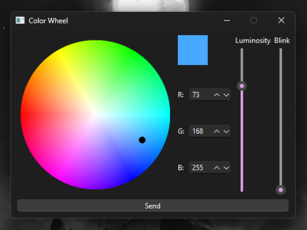

# RGB Spot - Color Wheel

Installation
============

### Installation via `pip`
- At the root of the project, execute: `pip install ./` to install the module.

- To run the module in a terminal, use: `python -m rgb_spot_color_wheel` or simply `rgb_spot_color_wheel`.

### Execution via VS Code
You can also run the project directly in VS Code by navigating to the project root and pressing F5 to start debugging.

Files Structure
===============

- `src/`: Contains the core functionality of the project.
- `tools/`: Includes a script to generate the color wheel.
- `misc/`: Contains the Arduino program required for the project to function, as well as the compiled `.exe` file of the project.
